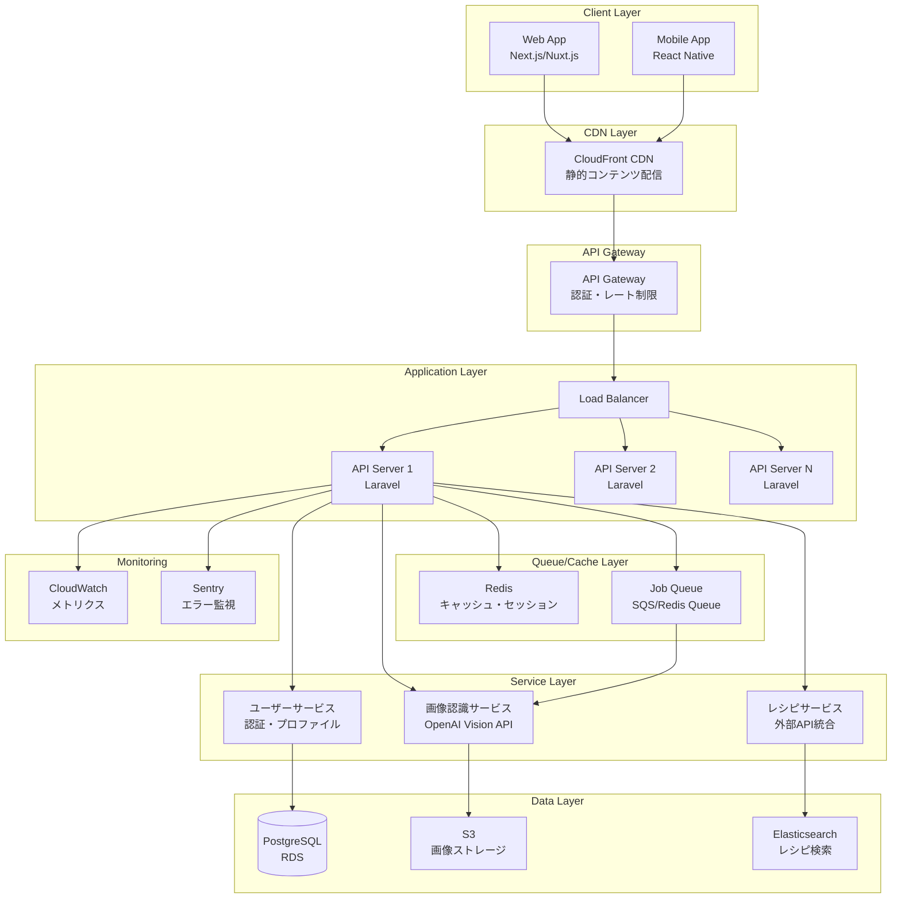

# Quick Chef アーキテクチャ設計書

## 1. システム構成図



## 2. API設計（OpenAPI 3.0）

```yaml
openapi: 3.0.0
info:
  title: Quick Chef API
  version: 1.0.0
  description: 食材認識とレシピ提案API

servers:
  - url: https://api.quickchef.app/v1

paths:
  /auth/register:
    post:
      summary: ユーザー登録
      requestBody:
        content:
          application/json:
            schema:
              type: object
              required: [email, password, name]
              properties:
                email:
                  type: string
                  format: email
                password:
                  type: string
                  minLength: 8
                name:
                  type: string
      responses:
        201:
          description: 登録成功
          content:
            application/json:
              schema:
                $ref: '#/components/schemas/AuthResponse'

  /auth/login:
    post:
      summary: ログイン
      requestBody:
        content:
          application/json:
            schema:
              type: object
              required: [email, password]
              properties:
                email:
                  type: string
                  format: email
                password:
                  type: string
      responses:
        200:
          description: ログイン成功
          content:
            application/json:
              schema:
                $ref: '#/components/schemas/AuthResponse'

  /ingredients/recognize:
    post:
      summary: 食材画像認識
      security:
        - bearerAuth: []
      requestBody:
        content:
          multipart/form-data:
            schema:
              type: object
              required: [image]
              properties:
                image:
                  type: string
                  format: binary
                  description: 画像ファイル（最大10MB）
      responses:
        200:
          description: 認識成功
          content:
            application/json:
              schema:
                $ref: '#/components/schemas/RecognitionResponse'
        202:
          description: 処理受付（非同期）
          content:
            application/json:
              schema:
                type: object
                properties:
                  job_id:
                    type: string
                  status_url:
                    type: string

  /ingredients/recognize/{jobId}/status:
    get:
      summary: 認識ジョブステータス確認
      parameters:
        - name: jobId
          in: path
          required: true
          schema:
            type: string
      responses:
        200:
          description: ステータス取得成功
          content:
            application/json:
              schema:
                $ref: '#/components/schemas/JobStatus'

  /recipes/search:
    post:
      summary: レシピ検索
      security:
        - bearerAuth: []
      requestBody:
        content:
          application/json:
            schema:
              type: object
              required: [ingredients]
              properties:
                ingredients:
                  type: array
                  items:
                    type: string
                  minItems: 1
                cuisine_type:
                  type: string
                  enum: [japanese, chinese, western, italian, other]
                cooking_time:
                  type: integer
                  description: 調理時間（分）
                difficulty:
                  type: string
                  enum: [easy, medium, hard]
      responses:
        200:
          description: 検索成功
          content:
            application/json:
              schema:
                $ref: '#/components/schemas/RecipeSearchResponse'

  /recipes/{id}:
    get:
      summary: レシピ詳細取得
      parameters:
        - name: id
          in: path
          required: true
          schema:
            type: string
      responses:
        200:
          description: 取得成功
          content:
            application/json:
              schema:
                $ref: '#/components/schemas/RecipeDetail'

  /users/history:
    get:
      summary: 認識履歴取得
      security:
        - bearerAuth: []
      parameters:
        - name: page
          in: query
          schema:
            type: integer
            default: 1
        - name: per_page
          in: query
          schema:
            type: integer
            default: 20
      responses:
        200:
          description: 履歴取得成功
          content:
            application/json:
              schema:
                $ref: '#/components/schemas/HistoryResponse'

components:
  securitySchemes:
    bearerAuth:
      type: http
      scheme: bearer
      bearerFormat: JWT

  schemas:
    AuthResponse:
      type: object
      properties:
        access_token:
          type: string
        token_type:
          type: string
          default: bearer
        expires_in:
          type: integer
        user:
          $ref: '#/components/schemas/User'

    User:
      type: object
      properties:
        id:
          type: string
        email:
          type: string
        name:
          type: string
        created_at:
          type: string
          format: date-time

    RecognitionResponse:
      type: object
      properties:
        recognition_id:
          type: string
        ingredients:
          type: array
          items:
            type: object
            properties:
              name:
                type: string
              confidence:
                type: number
                format: float
                minimum: 0
                maximum: 1
              category:
                type: string
        image_url:
          type: string
        processed_at:
          type: string
          format: date-time

    JobStatus:
      type: object
      properties:
        job_id:
          type: string
        status:
          type: string
          enum: [pending, processing, completed, failed]
        result:
          $ref: '#/components/schemas/RecognitionResponse'
        error:
          type: string

    RecipeSearchResponse:
      type: object
      properties:
        recipes:
          type: array
          items:
            $ref: '#/components/schemas/RecipeSummary'
        total:
          type: integer
        page:
          type: integer
        per_page:
          type: integer

    RecipeSummary:
      type: object
      properties:
        id:
          type: string
        title:
          type: string
        description:
          type: string
        image_url:
          type: string
        cooking_time:
          type: integer
        difficulty:
          type: string
        match_rate:
          type: number
          format: float
          description: 食材マッチ率

    RecipeDetail:
      allOf:
        - $ref: '#/components/schemas/RecipeSummary'
        - type: object
          properties:
            ingredients:
              type: array
              items:
                type: object
                properties:
                  name:
                    type: string
                  amount:
                    type: string
                  unit:
                    type: string
            steps:
              type: array
              items:
                type: object
                properties:
                  order:
                    type: integer
                  instruction:
                    type: string
                  image_url:
                    type: string
            nutrition:
              type: object
              properties:
                calories:
                  type: integer
                protein:
                  type: number
                fat:
                  type: number
                carbs:
                  type: number

    HistoryResponse:
      type: object
      properties:
        history:
          type: array
          items:
            type: object
            properties:
              recognition_id:
                type: string
              image_url:
                type: string
              ingredients:
                type: array
                items:
                  type: string
              created_at:
                type: string
                format: date-time
        pagination:
          type: object
          properties:
            total:
              type: integer
            page:
              type: integer
            per_page:
              type: integer
            total_pages:
              type: integer
```

## 3. データモデル

```sql
-- ユーザー管理
CREATE TABLE users (
    id UUID PRIMARY KEY DEFAULT gen_random_uuid(),
    email VARCHAR(255) UNIQUE NOT NULL,
    password_hash VARCHAR(255) NOT NULL,
    name VARCHAR(255) NOT NULL,
    created_at TIMESTAMP NOT NULL DEFAULT CURRENT_TIMESTAMP,
    updated_at TIMESTAMP NOT NULL DEFAULT CURRENT_TIMESTAMP
);

-- 認識履歴
CREATE TABLE recognitions (
    id UUID PRIMARY KEY DEFAULT gen_random_uuid(),
    user_id UUID NOT NULL REFERENCES users(id),
    image_url VARCHAR(500) NOT NULL,
    s3_key VARCHAR(500) NOT NULL,
    status VARCHAR(50) NOT NULL DEFAULT 'pending',
    processed_at TIMESTAMP,
    created_at TIMESTAMP NOT NULL DEFAULT CURRENT_TIMESTAMP,
    INDEX idx_user_created (user_id, created_at DESC)
);

-- 認識結果
CREATE TABLE recognition_ingredients (
    id UUID PRIMARY KEY DEFAULT gen_random_uuid(),
    recognition_id UUID NOT NULL REFERENCES recognitions(id),
    ingredient_id UUID NOT NULL REFERENCES ingredients(id),
    confidence DECIMAL(3,2) NOT NULL,
    position_data JSON,
    created_at TIMESTAMP NOT NULL DEFAULT CURRENT_TIMESTAMP,
    INDEX idx_recognition (recognition_id)
);

-- 食材マスタ
CREATE TABLE ingredients (
    id UUID PRIMARY KEY DEFAULT gen_random_uuid(),
    name VARCHAR(255) NOT NULL,
    name_en VARCHAR(255),
    category VARCHAR(100) NOT NULL,
    nutritional_data JSON,
    created_at TIMESTAMP NOT NULL DEFAULT CURRENT_TIMESTAMP,
    updated_at TIMESTAMP NOT NULL DEFAULT CURRENT_TIMESTAMP,
    INDEX idx_name (name),
    INDEX idx_category (category)
);

-- レシピキャッシュ
CREATE TABLE recipe_cache (
    id UUID PRIMARY KEY DEFAULT gen_random_uuid(),
    external_id VARCHAR(255) NOT NULL,
    source VARCHAR(50) NOT NULL,
    data JSON NOT NULL,
    cached_at TIMESTAMP NOT NULL DEFAULT CURRENT_TIMESTAMP,
    expires_at TIMESTAMP NOT NULL,
    UNIQUE KEY idx_external (external_id, source)
);

-- ユーザーお気に入り
CREATE TABLE user_favorites (
    user_id UUID NOT NULL REFERENCES users(id),
    recipe_id VARCHAR(255) NOT NULL,
    created_at TIMESTAMP NOT NULL DEFAULT CURRENT_TIMESTAMP,
    PRIMARY KEY (user_id, recipe_id)
);

-- 検索履歴
CREATE TABLE search_history (
    id UUID PRIMARY KEY DEFAULT gen_random_uuid(),
    user_id UUID NOT NULL REFERENCES users(id),
    ingredients JSON NOT NULL,
    filters JSON,
    results_count INTEGER NOT NULL DEFAULT 0,
    created_at TIMESTAMP NOT NULL DEFAULT CURRENT_TIMESTAMP,
    INDEX idx_user_created (user_id, created_at DESC)
);
```

## 4. セキュリティ設計

### 4.1 認証・認可
- **JWT認証**: アクセストークン（15分）、リフレッシュトークン（30日）
- **レート制限**: 
  - 未認証: 10リクエスト/分
  - 認証済み: 60リクエスト/分
  - 画像アップロード: 20リクエスト/時

### 4.2 データ保護
- **画像ストレージ**: S3プライベートバケット + 署名付きURL（有効期限1時間）
- **個人情報**: PII暗号化（AES-256）
- **通信**: TLS 1.3必須

### 4.3 入力検証
- **画像検証**:
  - 形式: JPEG, PNG, WebP
  - サイズ: 最大10MB
  - 寸法: 最大4000x4000px
  - ウイルススキャン: ClamAV

### 4.4 監査・コンプライアンス
- **ログ記録**: CloudWatch Logs（90日保持）
- **GDPR対応**: データエクスポート・削除API
- **監査証跡**: 全APIアクセスログ

## 5. コスト試算（10万MAU）

### 5.1 前提条件
- 1ユーザーあたり月20回利用
- 画像平均サイズ: 2MB
- レシピ検索: 認識の80%が実行

### 5.2 月間コスト内訳

| サービス | 使用量 | 単価 | 月額費用 |
|---------|--------|------|----------|
| **インフラストラクチャ** |
| EC2 (t3.medium x3) | 2,160時間 | $0.0416/時 | $90 |
| RDS PostgreSQL (db.t3.medium) | 720時間 | $0.082/時 | $59 |
| ElastiCache Redis (cache.t3.micro) | 720時間 | $0.017/時 | $12 |
| ALB | 1個 | $0.025/時 | $18 |
| S3ストレージ | 4TB | $0.023/GB | $92 |
| S3リクエスト | 400万回 | $0.0004/1000 | $2 |
| CloudFront | 8TB転送 | $0.085/GB | $680 |
| **外部API** |
| OpenAI Vision API | 200万回 | $0.01/回 | $20,000 |
| **その他** |
| Route 53 | - | - | $1 |
| CloudWatch | - | - | $50 |
| Sentry | 10万イベント | - | $26 |
| **合計** | | | **$21,030** |

### 5.3 コスト最適化戦略
1. **キャッシング強化**
   - 同一画像の再認識防止（30%削減見込み）
   - レシピ結果キャッシュ（API呼び出し50%削減）

2. **Reserved Instances**
   - EC2/RDS 1年契約で30%削減

3. **画像最適化**
   - アップロード時リサイズ（転送量50%削減）
   - WebP変換（さらに30%削減）

最適化後の推定月額: **約$12,000**

## 6. パフォーマンス設計

### 6.1 レスポンスタイム目標（2秒以内）
- 画像アップロード: 500ms
- 画像認識（キャッシュヒット）: 100ms
- 画像認識（API呼び出し）: 1,500ms
- レシピ検索: 300ms

### 6.2 スケーリング戦略
- **水平スケーリング**: Auto Scaling Group（CPU 70%閾値）
- **垂直スケーリング**: ピーク時のみ大型インスタンス
- **エッジキャッシング**: 画像・静的コンテンツ

### 6.3 精度向上（90%以上）
- **モデル選択**: GPT-4V（高精度モード）
- **前処理**: 画像鮮明化、ノイズ除去
- **後処理**: 信頼度スコアによるフィルタリング
- **フィードバックループ**: ユーザー修正による学習データ蓄積