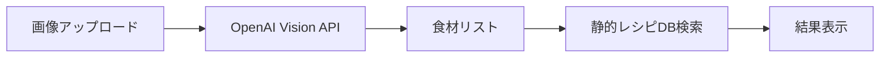
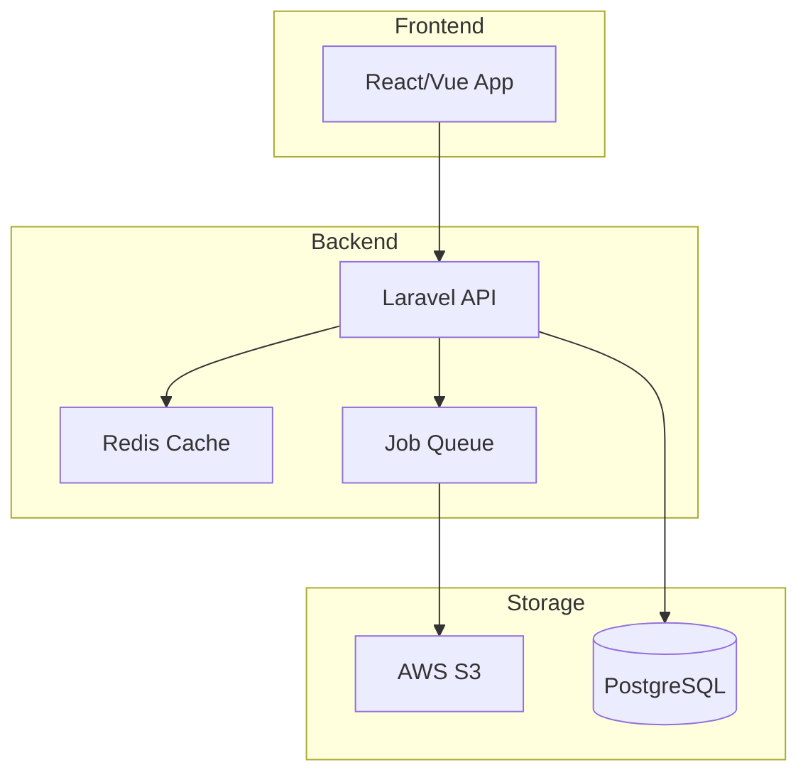

# Quick Chef 実装ガイド

## フェーズ別実装計画

### Phase 1: MVP (1-2週間)
**目標**: 基本的な食材認識とレシピ検索



**実装項目**:
- [ ] 基本的な画像アップロードAPI
- [ ] OpenAI Vision API統合
- [ ] 簡易レシピデータベース（JSON）
- [ ] 基本的なWeb UI

### Phase 2: スケーラブル版 (3-4週間)
**目標**: ユーザー認証とキャッシング追加



**実装項目**:
- [ ] JWT認証システム
- [ ] S3画像ストレージ
- [ ] Redisキャッシング
- [ ] 非同期ジョブ処理
- [ ] レシピAPI統合

### Phase 3: プロダクション版 (5-8週間)
**目標**: 高可用性とパフォーマンス最適化

**実装項目**:
- [ ] マイクロサービス分離
- [ ] CDN統合
- [ ] 監視・アラート設定
- [ ] A/Bテスト基盤
- [ ] 機械学習パイプライン

## キーテクノロジーの実装詳細

### 1. 画像認識パイプライン

```python
# 画像認識サービスの実装例
class FoodRecognitionService:
    def __init__(self, openai_client, cache_client):
        self.openai = openai_client
        self.cache = cache_client
    
    async def recognize(self, image_data: bytes) -> dict:
        # 画像ハッシュでキャッシュチェック
        image_hash = hashlib.sha256(image_data).hexdigest()
        cached = await self.cache.get(f"recognition:{image_hash}")
        if cached:
            return json.loads(cached)
        
        # 画像前処理
        processed_image = await self.preprocess_image(image_data)
        
        # OpenAI Vision API呼び出し
        response = await self.openai.chat.completions.create(
            model="gpt-4-vision-preview",
            messages=[{
                "role": "user",
                "content": [
                    {
                        "type": "text",
                        "text": RECOGNITION_PROMPT
                    },
                    {
                        "type": "image_url",
                        "image_url": {
                            "url": f"data:image/jpeg;base64,{processed_image}"
                        }
                    }
                ]
            }],
            max_tokens=300
        )
        
        # 結果解析とキャッシュ
        result = self.parse_response(response)
        await self.cache.setex(
            f"recognition:{image_hash}",
            3600,  # 1時間キャッシュ
            json.dumps(result)
        )
        
        return result
```

### 2. レシピマッチングアルゴリズム

```python
class RecipeMatchingEngine:
    def match_recipes(self, ingredients: List[str], 
                     recipes: List[Recipe]) -> List[MatchedRecipe]:
        matches = []
        
        for recipe in recipes:
            # 材料マッチ率計算
            required_ingredients = set(recipe.ingredients)
            available_ingredients = set(ingredients)
            
            match_rate = len(
                required_ingredients & available_ingredients
            ) / len(required_ingredients)
            
            # 追加材料数
            missing_count = len(
                required_ingredients - available_ingredients
            )
            
            # スコア計算（マッチ率重視、不足材料数でペナルティ）
            score = match_rate * 100 - missing_count * 5
            
            if score > 50:  # 閾値
                matches.append(MatchedRecipe(
                    recipe=recipe,
                    match_rate=match_rate,
                    score=score,
                    missing_ingredients=list(
                        required_ingredients - available_ingredients
                    )
                ))
        
        # スコア降順でソート
        return sorted(matches, key=lambda x: x.score, reverse=True)
```

### 3. キャッシング戦略

```yaml
# Redis キャッシング設定
cache_config:
  layers:
    - name: "recognition_cache"
      ttl: 3600  # 1時間
      key_pattern: "recognition:{image_hash}"
      
    - name: "recipe_search_cache"
      ttl: 1800  # 30分
      key_pattern: "recipes:{ingredients_hash}:{filters_hash}"
      
    - name: "user_session"
      ttl: 900   # 15分
      key_pattern: "session:{user_id}"
      
    - name: "rate_limit"
      ttl: 60    # 1分
      key_pattern: "rate:{user_id}:{endpoint}"
```

### 4. エラーハンドリング

```php
// Laravel でのエラーハンドリング実装
class FoodRecognitionController extends Controller
{
    public function recognize(Request $request)
    {
        try {
            // バリデーション
            $validated = $request->validate([
                'image' => 'required|image|max:10240|mimes:jpeg,png,webp'
            ]);
            
            // レート制限チェック
            if (!$this->checkRateLimit($request->user())) {
                throw new RateLimitException('Too many requests');
            }
            
            // 画像処理
            $result = $this->recognitionService->process(
                $request->file('image')
            );
            
            // 成功レスポンス
            return response()->json([
                'success' => true,
                'data' => $result
            ]);
            
        } catch (ValidationException $e) {
            return response()->json([
                'success' => false,
                'error' => 'VALIDATION_ERROR',
                'message' => $e->errors()
            ], 422);
            
        } catch (RateLimitException $e) {
            return response()->json([
                'success' => false,
                'error' => 'RATE_LIMIT_EXCEEDED',
                'message' => $e->getMessage(),
                'retry_after' => 60
            ], 429);
            
        } catch (OpenAIException $e) {
            // 外部APIエラーをログに記録
            Log::error('OpenAI API Error', [
                'error' => $e->getMessage(),
                'user_id' => $request->user()->id
            ]);
            
            return response()->json([
                'success' => false,
                'error' => 'EXTERNAL_SERVICE_ERROR',
                'message' => 'Image recognition service temporarily unavailable'
            ], 503);
            
        } catch (\Exception $e) {
            // 予期しないエラー
            Log::critical('Unexpected error', [
                'error' => $e->getMessage(),
                'trace' => $e->getTraceAsString()
            ]);
            
            return response()->json([
                'success' => false,
                'error' => 'INTERNAL_ERROR',
                'message' => 'An unexpected error occurred'
            ], 500);
        }
    }
}
```

## デプロイメント戦略

### 1. CI/CDパイプライン

```yaml
# .github/workflows/deploy.yml
name: Deploy to Production

on:
  push:
    branches: [main]

jobs:
  test:
    runs-on: ubuntu-latest
    steps:
      - uses: actions/checkout@v3
      - name: Run Tests
        run: |
          composer test
          npm test

  deploy:
    needs: test
    runs-on: ubuntu-latest
    steps:
      - name: Deploy to AWS
        run: |
          aws ecr get-login-password | docker login --username AWS --password-stdin $ECR_REGISTRY
          docker build -t quickchef-api .
          docker tag quickchef-api:latest $ECR_REGISTRY/quickchef-api:latest
          docker push $ECR_REGISTRY/quickchef-api:latest
          aws ecs update-service --cluster production --service quickchef-api --force-new-deployment
```

### 2. 監視設定

```yaml
# CloudWatch アラーム設定
alarms:
  - name: "API Response Time"
    metric: "ResponseTime"
    threshold: 2000  # 2秒
    evaluation_periods: 2
    
  - name: "Error Rate"
    metric: "4XXError"
    threshold: 10  # 10%
    evaluation_periods: 3
    
  - name: "OpenAI API Failures"
    metric: "ExternalAPIError"
    threshold: 5
    evaluation_periods: 1
```

## パフォーマンスチューニング

### 1. 画像最適化
```javascript
// 画像リサイズ・最適化
const sharp = require('sharp');

async function optimizeImage(inputBuffer) {
  return await sharp(inputBuffer)
    .resize(1024, 1024, {
      fit: 'inside',
      withoutEnlargement: true
    })
    .jpeg({
      quality: 85,
      progressive: true
    })
    .toBuffer();
}
```

### 2. データベース最適化
```sql
-- インデックス作成
CREATE INDEX CONCURRENTLY idx_recognitions_user_created 
ON recognitions(user_id, created_at DESC);

CREATE INDEX CONCURRENTLY idx_ingredients_name_trgm 
ON ingredients USING gin(name gin_trgm_ops);

-- パーティショニング（月次）
CREATE TABLE recognitions_2024_01 PARTITION OF recognitions
FOR VALUES FROM ('2024-01-01') TO ('2024-02-01');
```

### 3. キューワーカー設定
```php
// Supervisor設定
[program:quickchef-worker]
process_name=%(program_name)s_%(process_num)02d
command=php /var/www/artisan queue:work --sleep=3 --tries=3 --max-jobs=1000
autostart=true
autorestart=true
stopasgroup=true
killasgroup=true
numprocs=4
redirect_stderr=true
stdout_logfile=/var/log/quickchef-worker.log
```

## セキュリティチェックリスト

- [ ] HTTPS強制
- [ ] CORS設定
- [ ] SQLインジェクション対策
- [ ] XSS対策
- [ ] CSRF保護
- [ ] レート制限
- [ ] 入力検証
- [ ] ファイルアップロード検証
- [ ] 認証トークン有効期限
- [ ] APIキー管理
- [ ] ログの機密情報マスキング
- [ ] 定期的なセキュリティ監査